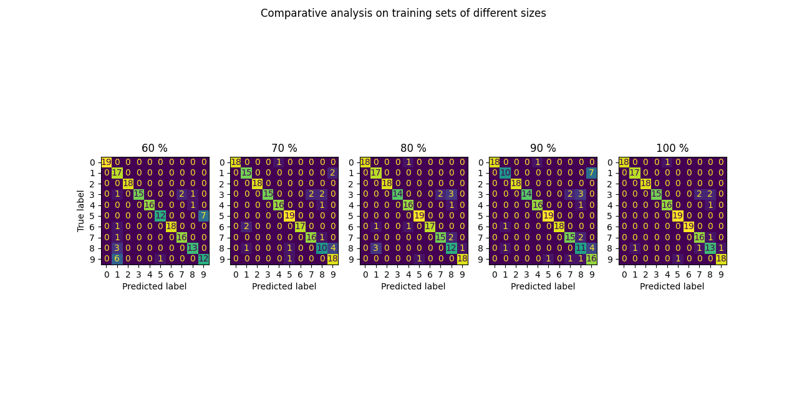

# ML Ops Repo

# Assignment 11: 
1. Create 80:10:10 train:dev:test split of the data.
2. Create smaller training sets that use 10,20,30,40,50,60,70,80,90,100% of the full training set.
3. For each of the smaller training sets, train the model (including hyper parameter tuning) and test of the same test set that was created in step 1.
4. Report the line chart that has on x-axis the percentage of training and y-axis test set macro f1.
5. Make some observations about the chart and write.
6. Compare the actual predictions on test set using the model trained with  20% training data vs 10% training data, and 30% vs 20% so-on. Find out what will be good metric for comparing predictions of two models and use that for comparison. Note: don't just say "it has higher accuracy" -- that is aggregate metric comparison. What we are after is a "guarantee that is the model trained with larger data likely to be as good or better on each instance?" Hint: Confusion metrics.

## Results:

### F1 Score on different sizes of dataset
.png)

Here we notice that the 
### Confusion matrices on different sizes of dataset

